

    <h1>AI 办公、实践与应用 Task 02 使用 AI 辅助制作 PPT</h1>

    记录人：zps1011&nbsp;&nbsp;&nbsp;&nbsp;&nbsp;&nbsp;记录时间：2025年5月18日

## 1、实践背景

在当今数字化快速发展的时代，AI 技术正以前所未有的方式改变着我们的工作和生活方式。特别是在办公自动化领域，利用 AI 生成 PPT 的技术正在成为提升工作效率的新宠。对于许多职场人士来说，制作演示文稿是日常工作中的重要组成部分。然而，传统的PPT制作过程往往耗时费力，需要投入大量的时间和精力进行资料收集、内容编排以及视觉设计。

在这种背景下，AI 生成 PPT 的工具应运而生。这类工具通过使用先进的人工智能算法，能够根据用户输入的主题或提供的大纲自动生成内容丰富、布局美观的演示文稿。这不仅极大地节省了时间，还能够让那些不具备专业设计技能的用户也能够轻松创建出高质量的 PPT 作品。此外，AI 技术还可以根据用户的个性化需求对 PPT 进行优化调整，如色彩搭配、字体选择等，使得每一份演示文稿都能精准地传达出创作者的意图，并有效吸引观众的注意力。

随着这项技术的不断发展和完善，越来越多的企业和个人开始尝试并依赖于 AI 生成 PPT 来满足其日常办公需求，展示了这一创新技术在提高工作效率、释放创造力方面的巨大潜力。

## 2、使用讯飞智文智能生成 PPT

[讯飞智文](https://zhiwen.xfyun.cn/)是一款由科大讯飞推出的 PPT 智能生成工具，基于其自研的星火认知大模型开发。旨在帮助用户快速、高效地创建和编辑 Word、PPT 文档。这款应用的核心功能包括智能生成文档、在线编辑与美化、一键动效与导出以及自动生成演讲稿等。无论是职场中的工作总结、产品发布、答辩，还是学校作业、教学课件，讯飞智文都能快速生成内容精准且设计精美的演示文档，辅助用户轻松应对各种场合。

### 2.1 一句话生成 PPT

使用方法：注册并登录讯飞智文 → 点击`一句话生成PPT`

我输入的是：**软考中级网络工程师备考指南**

	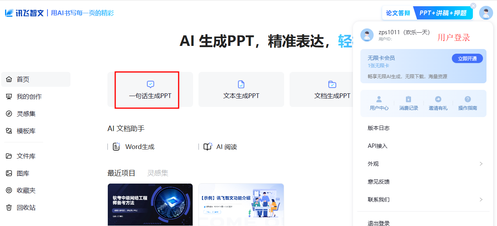

	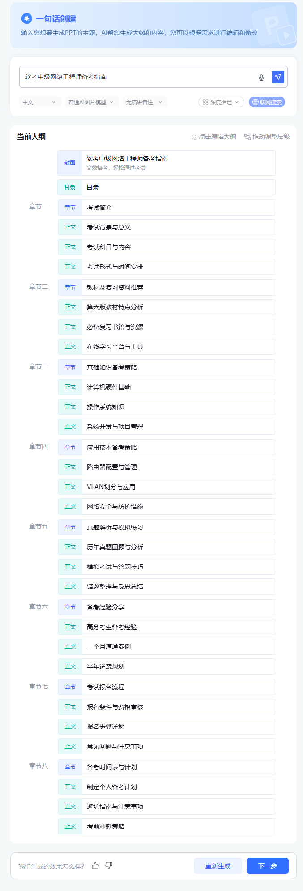

从第一次生成的大纲来看，基本内容都覆盖到了。如果需要修改大纲，可直接点击相应的内容修改；需要调整顺序的话，在章节前拖动即可。完成修改后，点击`下一步` 进行 PPT 模板选择。

### 2.2 PPT 模板选择

	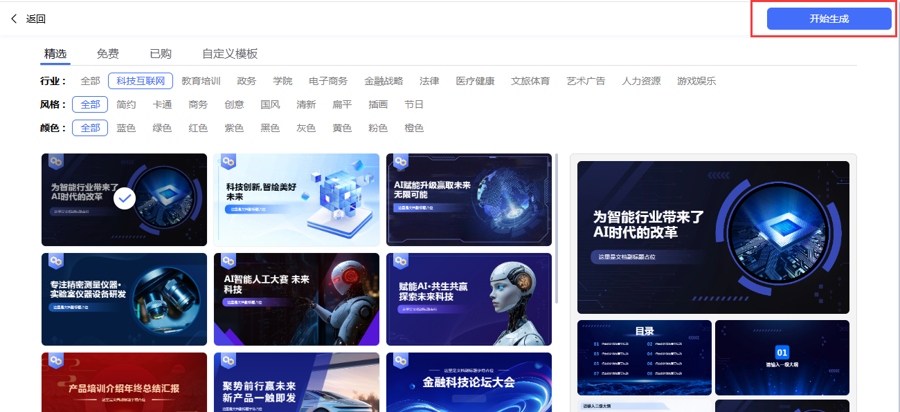

完成模板选择后，点击`开始生成`，静候几分钟，PPT 便成功生成。我们可对 PPT 中的文字、图片进行相应的编辑。

	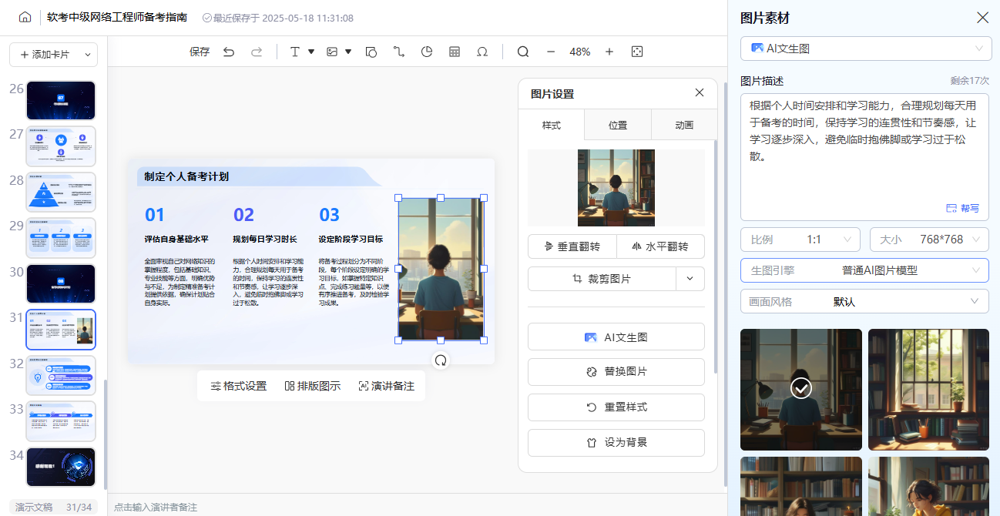

编辑完成后可`另存为长图`。

### 2.3 PPT 下载

	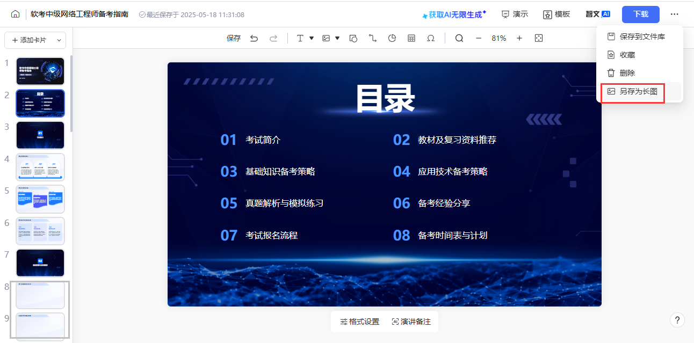

	

从长图中，我们发现，部分页面的 PPT 只有标题，缺失内容。个人并没有找到让 AI 只重新生成单张 PPT 的方法。总体上看，架构还是不错的，内容需要用户后期完善。

此款 AI 需要`付费下载` PPT。用户注册时，系统会赠送一张`智文无限卡`，激活该无限卡后，**单日**不限次数下载 PPT。

	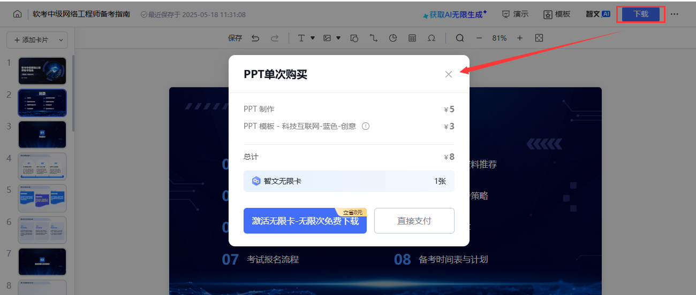

## 3、使用通义千问智能生成 PPT

[通义千问](https://www.tongyi.com/)是阿里云研发的国产大语言模型，其 PPT 智能创作功能通过多模态技术实现高效演示文稿生成。该系统支持从主题输入到完整 PPT 输出的全流程自动化，可智能分析文档内容提取关键信息，自动生成逻辑清晰的大纲和图文排版。内置 50 余种专业模板和智能配色方案，能根据场景自动优化视觉设计，并支持语音指令修改和网页内容抓取。实际应用中，用户仅需 15 分钟即可完成传统需要 8 小时制作的演示文稿，在教育、商业等领域显著提升工作效率，目前基础功能仍保持免费开放使用。

### 3.1 PPT 创作

登录通义千问后，点击`PPT创作`，输入你的需求，即可开始。

	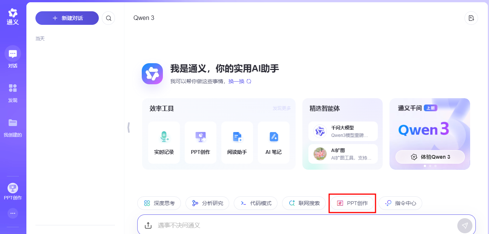

	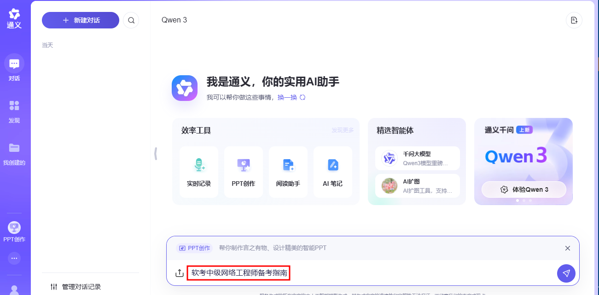

创作开始后，会生成一个大纲，如需对大纲进行修改大纲，可在大纲相应位置直接点击修改。完成后点击`下一步`。在点击下一步操作后，完成 PPT 模板选择，点击`生成PPT`。

	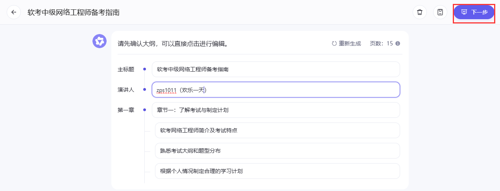

生成 PPT 后，我们可在 PPT 直接修改图片、文字。修改图片的方法如下图所示。

	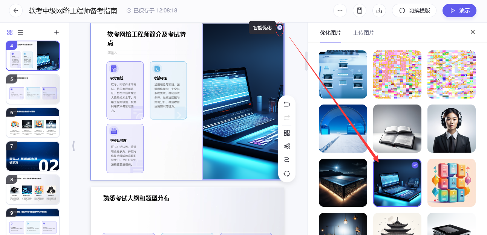

### 3.2 PPT 下载

点击顶部的下载图案 → 选择期望的导出方式。

	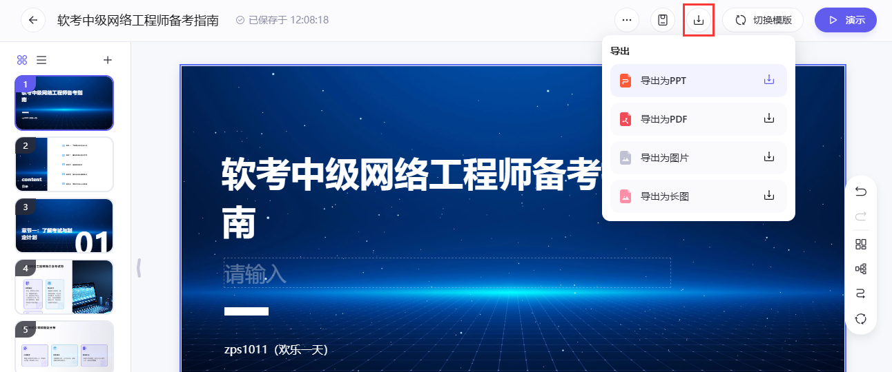

通义千问导出的 PPT 请见附件。由于 Github 上传 PPT 有大小限制，我对 PPT 中的图片做了压缩处理。

## 总结

本次实践尝试使用`讯飞智文`、`通义千问`两款 AI 进行了软考中级网络工程师备考指南的 PPT 创作。

对于讯飞智文，其在知识问答和代码能力上表现不错，特别是在处理专业术语和真题关联上有优势。讯飞能自动提取教程考点，形成知识框架，但模板内容比较保守；PPT 模板选择较为丰富。但其在 PPT 生成中可能在创意和设计上稍逊，且在生成中会出现只有大纲标题，但内容为空的页面。以及在 PPT 下载时需要付费，但长图导出是免费的，清晰度一般。

对于通义千问，这款产品支持全链路内容生成，包括从主题生成大纲、解析长文档，还有结合全网数据自动抓取资料，这看起来在处理复杂内容和自动化方面比较强。通义千问的动态图表生成和语音指令修改是很突出的优点。此外，模板免费，这对用户来说是个不错的优势。但是，其 PPT 生成较为简单，编辑功能有限，模板选择有限。

## 参考资料

- [Cpt2-用讯飞智文做一个小案例](https://www.datawhale.cn/learn/content/162/3821)

- [2025年度最佳AI生成PPT指南：7款顶级工具深度对比与实战教程](https://www.cursor-ide.com/blog/ai-ppt-guide)

- [AI_PPT 工具谁更好用？Kimi 、Gamma 等 6 款产品实测](https://zhuanlan.zhihu.com/p/715896326)

## 附件

- [通义千问-软考中级网络工程师备考指南](https://github.com/zps1011/zps1011_learning_notes/blob/main/%E7%BB%84%E9%98%9F%E5%AD%A6%E4%B9%A0/AI%E5%8A%9E%E5%85%AC%E3%80%81%E5%AE%9E%E8%B7%B5%E4%B8%8E%E5%BA%94%E7%94%A8/%E9%80%9A%E4%B9%89%E5%8D%83%E9%97%AE-%E8%BD%AF%E8%80%83%E4%B8%AD%E7%BA%A7%E7%BD%91%E7%BB%9C%E5%B7%A5%E7%A8%8B%E5%B8%88%E5%A4%87%E8%80%83%E6%8C%87%E5%8D%97.pptx)