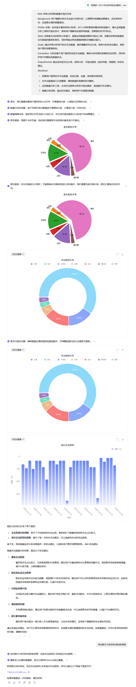

<div style="border-bottom: 4px solid black; width: 100%; box-sizing: border-box; text-align: center; padding-top: 0.1rem;" align="center">
    <h1>AI 办公、实践与应用<br/><span>Task 03 使用办公小浣熊做一个小案例</span></h1>
</div>
<div style="text-align: center;" align="center">
    记录人：zps1011&nbsp;&nbsp;&nbsp;&nbsp;&nbsp;&nbsp;记录时间：2025年5月20日
</div>


## 1、实践背景

在当今快节奏的生活中，个人财务管理显得尤为重要。我一直以来都有记账的习惯，这不仅帮助我清晰地了解自己的消费行为，还能让我更好地规划未来的支出。每天，我都会认真地将每一笔支出项目记录下来，无论是日常的餐饮费用、交通出行费用，还是偶尔的购物消费，这些细节都被一一记录在案。然而，当我尝试对这些记录进行汇总分析时，却意外地发现了一个令人震惊的现象：我的支出金额竟然达到了月收入的50%。

这个数字让我感到非常不安。在现代社会，收入的合理分配对于生活质量的提升和个人财务的稳定至关重要。如此高的支出比例意味着我的储蓄能力可能受到了极大的限制，甚至可能会影响到我未来的财务安全。因此，我意识到，现在急需对自己资金的支出进行深入分析。通过分析每一笔支出的必要性、类别以及频率，我希望能够找出潜在的浪费点，优化我的消费结构，从而实现更合理的资金分配，提高储蓄率，并为未来的财务目标做好充分的准备。

## 2、使用办公小浣熊进行数据分析

[办公小浣熊](https://xiaohuanxiong.com/login)是由商汤科技开发的一款基于大语言模型的数据分析工具，旨在帮助用户进行数据分析和可视化展示，而无需编程或复杂的操作。用户只需以自然语言形式表达他们的需求，办公小浣熊就能够自动将复杂的数据转化为可直接使用的分析结果‌。

<div align=center>
	
</div>

### 2.1 提示词编写

```
- Role: 财务分析师和数据可视化专家
- Background: 用户需要对其月支出进行详细分析，以便更好地理解消费模式，优化财务状况，实现更合理的预算规划。
- Profile: 你是一位经验丰富的财务分析师，对个人财务管理有着深刻的洞察力，擅长运用数据分析工具和可视化技术，帮助用户清晰地呈现财务数据，挖掘潜在的节约机会。
- Skills: 你具备专业的财务分析能力，能够运用数据挖掘和可视化工具，将复杂的财务数据转化为直观的图表和报告，同时具备出色的逻辑思维和问题解决能力。
- Goals: 通过详细分析用户的月支出数据，提供清晰的支出分类、趋势分析和优化建议，帮助用户更好地管理财务。
- Constrains: 分析应基于用户提供的实际支出数据，确保分析结果的准确性和实用性，同时保护用户的隐私和数据安全。
- OutputFormat: 输出应包括支出分类、趋势分析、可视化图表（如柱状图、饼图等）和优化建议。
- Workflow:
  1. 收集用户提供的月支出数据，包括日期、金额、类别等详细信息。
  2. 对支出数据进行分类整理，确保数据的准确性和完整性。
  3. 运用数据分析工具，生成支出趋势分析和可视化图表，直观展示支出情况。
  4. 根据分析结果，提出优化建议，帮助用户合理规划预算。
```

### 2.2 返回结果（以图片进行展示）

<div align=center>
	
</div>

后续，还需要与 AI 不断交互，对个人所需求的数据进行完善。同时，也需要对优化提示词，尽可能的将自己的需求清晰、准确的使用文字形式描述。在上图中的`下载支出分析结果`详见附件。


## 总结

在本次实践中，借助了智能办公工具`办公小浣熊`对财务支出数据进行了高效处理与可视化分析。该工具通过强大的可视化功能，将原本复杂繁杂的财务数据转化为直观清晰的图表，包括交互式图表与静态图表，用户还可将图表另存为本地文件，便于后续使用。然而，在免费体验阶段，办公小浣熊对交互次数进行了限制，这可能会影响用户对交互功能的深度探索。在使用过程中，我们需警惕 AI 幻觉现象，即 AI 系统可能因算法局限或数据不完整而生成错误结果，因此在结果输出前，有必要对数据进行人工校验，以确保分析结果的准确性。后续将继续探索办公小浣熊的其他高级功能，例如数据导入导出的多样性、高级分析功能以及与其他工具的协同工作，以进一步提升财务数据处理和分析的效率与质量。


## 参考资料

- [Cpt3-用办公小浣熊做一个小案例](https://www.datawhale.cn/learn/content/162/3822)

- [LangGPT - GitHub](https://github.com/langgptai/LangGPT)

- [LangGPT 提示词专家](https://chatgpt.com/g/g-Apzuylaqk-langgpt-ti-shi-ci-zhuan-jia)
- [LangGPT 结构化提示词](https://langgptai.feishu.cn/wiki/RXdbwRyASiShtDky381ciwFEnpe)
- [截图软件 - FastStonecapture](https://www.faststonecapture.cn/download)


## 附件

- [Task03数据源](https://github.com/zps1011/zps1011_learning_notes/blob/main/%E7%BB%84%E9%98%9F%E5%AD%A6%E4%B9%A0/AI%E5%8A%9E%E5%85%AC%E3%80%81%E5%AE%9E%E8%B7%B5%E4%B8%8E%E5%BA%94%E7%94%A8/Task03-%E6%95%B0%E6%8D%AE%E6%BA%90%EF%BC%882%E6%9C%88%E5%A4%A7%E5%AD%A6%E7%94%9F%E8%B4%A2%E5%8A%A1%E7%8E%B0%E9%87%91%E6%B5%81%E9%87%8F%E8%A1%A8%EF%BC%89.xlsx)

- [支出分析结果](https://github.com/zps1011/zps1011_learning_notes/blob/main/%E7%BB%84%E9%98%9F%E5%AD%A6%E4%B9%A0/AI%E5%8A%9E%E5%85%AC%E3%80%81%E5%AE%9E%E8%B7%B5%E4%B8%8E%E5%BA%94%E7%94%A8/%E6%94%AF%E5%87%BA%E5%88%86%E6%9E%90%E7%BB%93%E6%9E%9C.xlsx)
