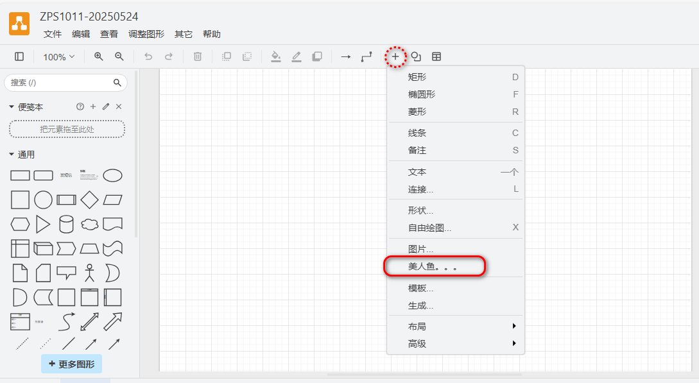

<div style="border-bottom: 4px solid black; width: 100%; box-sizing: border-box; text-align: center; padding-top: 0.1rem;" align="center">
    <h1>AI 办公、实践与应用<br/><span>Task 04 使用 AI 画图</span></h1>
</div>
<div style="text-align: center;" align="center">
    记录人：zps1011&nbsp;&nbsp;&nbsp;&nbsp;&nbsp;&nbsp;记录时间：2025年5月24日
</div>


## 1、实践背景

随着人工智能技术的发展，AI 画图作为一种新兴创作方式，正在改变艺术创作模式。它通过深度学习算法，根据输入的文本或指令生成图像，广泛应用于游戏设计、广告创意、教育等领域，为艺术创作带来高效性和创新性。同时，AI 画图降低了艺术创作门槛，使更多人能够参与其中，但也引发了关于艺术价值和创作角色的讨论。作为一种新兴实践，AI 画图正成为艺术领域的重要力量，推动艺术与科技的融合。本次学习将使用 Mermaid 进行画图。

## 2、使用 Mermaid 进行画图

Mermaid 是一款基于文本的开源图表工具，通过简洁代码快速生成流程图、思维导图等可视化图形，特别适合技术文档编写和项目管理。其纯文本特性便于版本控制与跨平台协作，对比传统绘图工具更高效灵活，能显著提升网络工程师在架构设计、故障排查及汇报演示中的专业性与工作效率。

画图过程：

打开网站：https://app.diagrams.net

点击` + `号 → 选择 `美人鱼。。(Mermaid)`  → 粘贴以下 graph TD 的代码 → 点击 `插入`

<div align=center>
	
</div>

```
graph TD
    A[软考中级网络工程师备考经验述职汇报] --> B[个人背景与考证目标]
    A --> C[系统化备考策略]
    A --> D[关键经验总结]
    A --> E[成果转化应用]
    A --> F[未来提升方向]

    B --> B1("现岗位职责：<br>事业单位网络运维与技术保障")
    B --> B2("考证动机：<br>职称晋升需求/技术体系完善")
    B --> B3("资质基础：<br>5年网络管理经验/CCNA认证")

    C --> C1("三阶段备考规划")
    C1 --> C1a("准备阶段（1个月）<br>考纲解析/教材筛选")
    C1 --> C1b("强化阶段（2个月）<br>专题突破/实验模拟")
    C1 --> C1c("冲刺阶段（3周）<br>真题演练/错题复盘")

    C --> C2("高效学习方法")
    C2 --> C2a("双轨知识体系：<br>理论↔实践")
    C2 --> C2b("工具应用：<br>Packet Tracer/Wireshark")
    C2 --> C2c("学习社群：<br>软考论坛/技术群组")

    D --> D1("成功要素")
    D1 --> D1a("时间管理：<br>碎片化学习法")
    D1 --> D1b("应试技巧：<br>题型分解/时间分配")
    D1 --> D1c("心理建设：<br>模拟压力测试")

    D --> D2("突破难点")
    D2 --> D2a("上午题：<br>计算机组成原理")
    D2 --> D2b("下午题：<br>网络规划设计")
    D2 --> D2c("实验题：<br>VPN隧道配置")

    E --> E1("持证优势：<br>纳入专业技术人才库")
    E --> E2("工作提升：<br>ISO27001安全体系落地")
    E --> E3("技术辐射：<br>组织部门培训3场")

    F --> F1("技术深化：<br>备战高级网络规划设计师")
    F --> F2("成果转化：<br>智慧园区网络改造项目")
    F --> F3("经验传承：<br>建立新员工备考机制")
```

生成图片如下所示：

<div align=center>
	
</div>

## 3、使用 deepseek 生成 markdown 格式的思维导图

```
# 提示词输入
角色：事业单位网络工程师，持有软考中级网络工程师证书，准备参加职称评比。
背景：上级领导得知我考取了软考中级网络工程师证书，希望我分享备考经验。
要求：撰写一份述职汇报的思维导图，内容条理清晰、逻辑合理、概述精要，思维导图采用Markdown格式，仅包含两个层级。
```

```markdown
输出如下：
# 软考中级网络工程师备考经验述职汇报

## 一、个人背景与考证目标
- 现岗位职责：事业单位网络运维与技术保障
- 考证动机：职称晋升需求/技术体系完善
- 资质基础：5年网络管理经验/CCNA认证

## 二、系统化备考策略
### 1. 三阶段备考规划
- 准备阶段（1个月）：考纲解析/教材筛选
- 强化阶段（2个月）：专题突破/实验模拟
- 冲刺阶段（3周）：真题演练/错题复盘

### 2. 高效学习方法
- 双轨知识体系：理论（OSI模型/IPv6协议）↔实践（ACL配置/故障排查）
- 工具应用：Packet Tracer模拟器/Wireshark抓包分析
- 学习社群：软考论坛每日打卡/技术群组案例讨论

## 三、关键经验总结
### 1. 成功要素
- 时间管理：碎片化学习法（早晚各1.5小时）
- 应试技巧：题型分解法/答题时间分配策略
- 心理建设：模拟考试压力测试

### 2. 突破难点
- 上午题：计算机组成原理计算题
- 下午题：网络规划设计大题
- 实验题：VPN隧道配置实操

## 四、成果转化应用
- 持证优势：纳入单位专业技术人才库
- 工作提升：ISO27001安全体系落地实施
- 技术辐射：组织部门网络知识培训3场

## 五、未来提升方向
- 技术深化：备战高级网络规划设计师
- 成果转化：参与智慧园区网络改造项目
- 经验传承：建立新员工备考指导机制
```

生成图片如下所示：

<div align=center>
	
</div>

## 总结

在本次实践中，我们学习了基于 Mermaid 语法规范的智能图表生成体系，该技术通过自然语言处理（NLP）构建语义理解层，将用户输入的流程图逻辑转化为结构化 Mermaid 代码，经语法解析引擎与 SVG 渲染引擎生成可交互矢量图，其核心突破点在于语义到语法的精准映射机制、AST（抽象语法树）驱动的智能纠错模块，以及支持网络拓扑图与设备配置联动的双向同步协议，也为网络架构设计与技术方案迭代提供了标准化、自动化的可视化方案。


## 参考资料

- [Cpt4 - 用 AI 画 “靓” 图](https://www.datawhale.cn/learn/content/162/3823)


## 附件

- [软考中级网络工程师备考经验述职汇报_画图结果](https://github.com/zps1011/zps1011_learning_notes/blob/main/组队学习/AI办公、实践与应用/Task04-zps1011_20250524.drawio)
