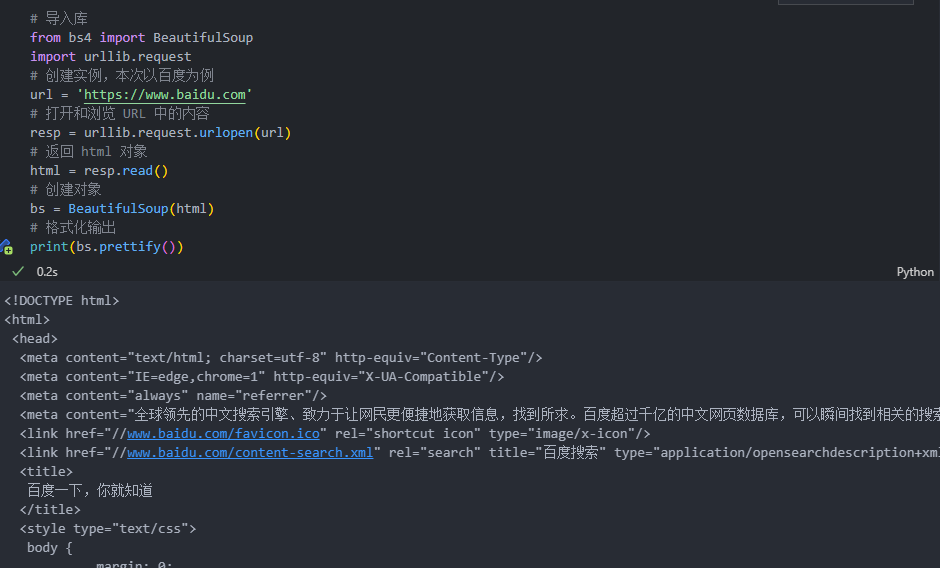
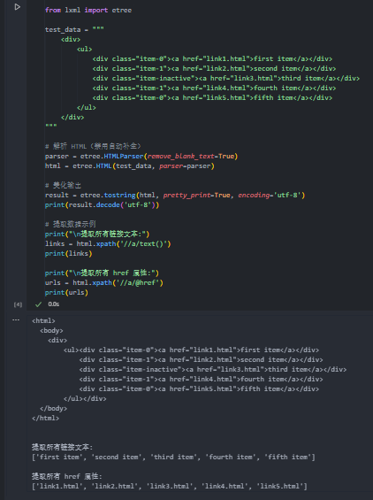

<div style="border-bottom: 4px solid black; width: 100%; box-sizing: border-box; text-align: center; padding-top: 0.1rem;" align="center">
    <h1>网络爬虫技术入门<br/><span>Task 02 数据解析与提取</span></h1>
</div>
<div style="text-align: center;" align="center">
    记录人：zps1011&nbsp;&nbsp;&nbsp;&nbsp;&nbsp;&nbsp;记录时间：2025年6月21日
</div>


## 1、数据解析技术

当服务器成项响应请求返回网页的数据后，我们需要从纷繁复杂的网页数据中提取到与目标相关的数据，这个过程为解析网页数据，也是网络爬虫中的关键步骤。选择适合的技术解析网页数据至关重要。Python 中提供了`正则表达式、Xpath、BeautifulSoup4` 等多种解析网页数据的技术，关于这些技术的相关介绍如下：

## 2、 正则表达式

正则表达式是一种文本模式，用于检索字符串中是否有符合该模式的子串，或者对匹配到的子串进行替换。

正则表达式的优点是功能强大，速度快，准确度高；缺点是只适合匹配文本的字面意义，而不适合匹配文本意义。例如，正则表达式在匹配嵌套了 HTML 代码的文本时，会忽略 HTML 代码本身存在的层次结构，而将 HTML 代码作为普通文本进行搜索。

### 2.1 正则表达式的语法

#### 2.1.1 元字符

在正则表达式中，其是指具有特殊含义的专用字符，主要用于规定其前导字符在给定字符串中的出现的模式，常见元字符如下表所示。

| 元字符 | 含义                                                     |
| ------ | -------------------------------------------------------- |
| .      | 匹配任意字符（换行符除外）                               |
| ^      | 匹配字符串的开头                                         |
| $      | 匹配字符串的结尾                                         |
| \|     | 或。连接多个子表达式，匹配与任意子表达式模式相同的字符串 |
| []     | 字符组，匹配其中出现的任意一个字符                       |
| -      | 连字符，匹配指定范围内的任意一个字符                     |
| *      | 重复0次或更多次                                          |
| +      | 重复1次或更多次                                          |
| ?      | 重复0次或1次                                             |
| {n}    | 重复n次                                                  |
| {n,}   | 重复n次或更多次                                          |
| {n,m}  | 重复n到m次                                               |
| a\|b   | 匹配字符a或字符b                                         |
| [...]  | 匹配字符组中的字符                                       |
| [^...] | 匹配除了字符组中字符的所有字符                           |

#### 2.1.2 预定义字符集

预定义字符集以更简洁的方式描述了一些由普通字符和元字符组合的模式。常用的预定义字符集如下表所示。

| 预定义字符集 | 含义                                      |
| ------------ | ----------------------------------------- |
| \w           | 匹配字⺟或数字或下划线                    |
| \s           | 匹配任意的空⽩符                          |
| \d           | 匹配数字                                  |
| \b           | 匹配单词的边界                            |
| \n           | 匹配⼀个换⾏符                            |
| \t           | 匹配⼀个制表符                            |
| \W           | 与\w 相反，匹配⾮字⺟或数字或下划线的字符 |
| \S           | 与\s 相反，匹配⾮空⽩符。等价于[ ^\s]     |
| \D           | 与\d 相反，匹配⾮数字。等价于[ ^\d]       |
| \B           | 与\b 相反，匹配不出现在单词边界的元素     |
| \A           | 仅匹配字符串开头，等价于 ^                |
| \Z           | 仅匹配字符串结尾，等价于 $                |

> ^[1-9]\d*$：用于匹配一个**不以零开头的正整数**。
>
> ^[1-9]\d*|0$：匹配正整数（不以零开头）或单独的零。
>
> ^-[1-9]\d*$：匹配 负整数（不以 `-0` 开头）
>
> ^-?[1-9]\d*$：匹配 可选的负号 + 非零开头的整数。

#### 2.1.3 贪婪匹配与惰性匹配

| 符号 | 含义                     |
| ---- | ------------------------ |
| .*   | 贪婪匹配                 |
| .*?  | 惰性匹配（爬虫用的较多） |

```bash
str: 玩⼉吃鸡游戏, 晚上⼀起上游戏, ⼲嘛呢? 打游戏啊
reg: 玩⼉.*?游戏

此时匹配的是: 玩⼉吃鸡游戏

reg: 玩⼉.*游戏 
此时匹配的是: 玩⼉吃鸡游戏, 晚上⼀起上游戏, ⼲嘛呢? 打游戏
```

```html
str: <div>胡辣汤</div>
reg: <.*>
结果: <div>胡辣汤</div>
```

### 2.2 re 模块的使用

#### 2.2.1 findall 查找所有，返回 list ，代码如下。

```python
import re

list1 = re.findall("m", "mai le fo len, mai nimei!")
print(list1)  # ['m', 'm', 'm']
```

```python
import re

list2 = re.findall(r"\d+", "我的电话号是:1011, 我男朋友的电话是:0513")
print(list2)  # ['1011', '0513']
```

#### 2.2.2 search 会进行匹配，如果匹配到`第一个`结果就返回，如果匹配不到则返回 None 。拿数据需要`.group()`。代码如下。

```python
import re

ret = re.search(r'\d', '5点之前. 你要给我5000万').group()
print(ret)  # 5
```

#### 2.2.3 `finditer`和`findall`差不多，匹配字符串中所有的内容，只不过这时返回的是迭代器，从迭代器中拿到内容需要`.group()`。

```python
import re

it = re.finditer(r"\d+", "我的电话号是:1011, 我男朋友的电话是:0513")
print(it)  # <callable_iterator object at 0x000001F4591F3F10> 。输出 match 对象

for i in it:
    print(i)
# <re.Match object; span=(7, 11), match='1011'>
# <re.Match object; span=(22, 26), match='0513'>
# span=(7, 11)， 表示匹配的起始索引（包含）和结束索引（不包含）

it = re.finditer(r"\d+", "我的电话号是:1011, 我男朋友的电话是:0513")
for i in it:
    print(i.group()) # 返回匹配的字符串内容
# 1011
# 0513
```

```bash
# 字符串中文字符位置
0:我 1:的 2:电 3:话 4:号 5:是 6:: 7:1 8:0 9:1 10:1 → "1011"
... 22:0 23:5 24:1 25:3 → "0513"
```

> 正则表达式只匹配数字序列，不关心周围的文本。

#### 2.2.4 `match`只能从字符串的开头进行匹配

```python
import re

s = re.match(r"\d+", "我的电话号是:1011, 我男朋友的电话是:0513")
print(s.group())
# AttributeError: 'NoneType' object has no attribute 'group'
```

> 报错分析：
>
> re.match()函数**只能从字符串开头进行匹配**，而目标字符串"我的电话号是:1011..."的开头是中文而非数字，导致匹配失败返回`None`，此时调用`None.group()`方法会触发`AttributeError`，因为`None`对象没有`group`属性。

```python
import re

s = re.match(r"\d+", "1011, 我男朋友的电话是:0513")
print(s.group())  # 1011
```

#### 2.2.5 `compile()`函数对正则表达式进行预编译，从而生成一个代表正则表达式的 Pattern 对象。

- **compile(pattern, flags=0)**

> pattern 表示一个正则表达式
>
> flags 用于指定正则表达式匹配的模式

```python
import re

# 创建 Pattern 对象
regex_obj = re.compile(r'[\u4e00-\u9fa5]+')
print(type(regex_obj)) # <class 're.Pattern'>
```

```python
import re

obj = re.compile(r"\d+")
ret = obj.finditer("我的电话号是:1011, 我男朋友的电话是:0513")
for it in ret:
    print(it.group())
# 1011
# 0513
```

```python
import re

obj = re.compile(r'\d{3}')  # 将正则表达式编译成为⼀个正则表达式对象, 规则要匹配的是3个数字
ret = obj.search('abc1234eeee')  # 正则表达式对象调⽤search, 参数为待匹配的字符串
print(ret.group())  # 结果: 123
```

#### 2.2.6 单独提取正则中的内容

- 单独获取到正则中的具体内容可以给分组起名字。**(?P<分组名字>正则)**

```python
import re

s = """
<div class='jay'><span id='1'>郭麒麟</span></div>
<div class='jj'><span id='2'>宋铁</span></div>
<div class='jolin'><span id='3'>大聪明</span></div>
<div class='sylar'><span id='4'>范思哲</span></div>
<div class='tory'><span id='5'>胡说八道</span></div>
"""

# (?P<分组名字>正则) 可以单独从正则匹配的内容中进一步提取内容
obj = re.compile(r"<div class='.*?'><span id='(?P<id>\d+)'>(?P<zhou>.*?)</span></div>", re.S)  # re.S: 让.能匹配换行符
result = obj.finditer(s)
for it in result:
    print(it.group("zhou"))
    print(it.group("id"))
# 郭麒麟
# 1
# 宋铁
# 2
# 大聪明
# 3
# 范思哲
# 4
# 胡说八道
# 5
```

```python
import re

s = """
<div class='⻄游记'><span id='10010'>中国联通</span></div>
"""
obj = re.compile(r"<span id='(?P<id>\d+)'>(?P<name>\w+)</span>", re.S)
result = obj.search(s)
print(result.group())  # 结果: <span id='10010'>中国联通</span>
print(result.group("id"))  # 结果: 10010 。获取id组的内容
print(result.group("name"))  # 结果: 中国联通。获取name组的内容
```

> - `?P<id>`：定义名为 `id` 的捕获组。
> - `\d+`：匹配1个或多个数字。
> - `?P<name>`：定义名为 `name` 的捕获组。
> - `\w+`：匹配1个或多个字母/数字/下划线。

从代码中，我们发现，在 `\w+`：匹配1个或多个字母/数字/下划线的定义中，`print(result.group("name"))` 可以输出中国联通。这是因为编译器会默认选择 Python 3，而  Python 3 默认启用 Unicode 匹配，即 Python 3 的 `\w` **默认支持 Unicode 文字**（包括中文）。

验证实验：

```python
import re

# 实验1：默认模式（匹配中文）
print(re.findall(r'\w+', 'Hello 世界 zps_1011'))  
# 输出: ['Hello', '世界', 'zps_1011']

# 实验2：ASCII 模式（不匹配中文）
print(re.findall(r'\w+', 'Hello 世界 zps_1011', re.ASCII))  
# 输出: ['Hello', 'zps_1011']
```

若只想匹配字母/数字/下划线（排除中文），需显式指定：

```python
# 方法1：使用 ASCII 标志
re.compile(r'(?P<name>[a-zA-Z0-9_]+)', re.ASCII)

# 方法2：直接指定字符集
re.compile(r'(?P<name>[a-zA-Z\u4e00-\u9fa5]+)')  # 明确允许中文
```

## 3、bs4 模块安装和使用

### 3.1 BeautifulSoup 安装

```python
pip3 install bs4
# pip install -i https://pypi.tuna.tsinghua.edu.cn/simple bs4

pip3 install lxml
```

### 3.2 基本用法

```python
# 导入库
from bs4 import BeautifulSoup
import urllib.request
# 创建实例，本次以百度为例
url = 'https://www.baidu.com'
# 打开和浏览 URL 中的内容
resp = urllib.request.urlopen(url)
# 返回 html 对象
html = resp.read()
# 创建对象
bs = BeautifulSoup(html)
# 格式化输出
print(bs.prettify())
```

<div align=center>
	
</div>


## 4、XPath 的使用

XPath 即为 XML 路径查询语言，是一种用来确定 XML 在文档中某部分位置的语言。XPath 可用来在 XML 文档中对元素和属性进行遍历。

### 4.1 导包

```python
# pip install lxml

from lxml import etree
```

4.2 基本使用

```python
from lxml import etree

test_data = """
    <div>
        <ul>
            <div class="item-0"><a href="link1.html">first item</a></div>
            <div class="item-1"><a href="link2.html">second item</a></div>
            <div class="item-inactive"><a href="link3.html">third item</a></div>
            <div class="item-1"><a href="link4.html">fourth item</a></div>
            <div class="item-0"><a href="link5.html">fifth item</a></div>
        </ul>
    </div>
"""

# 解析 HTML（禁用自动补全）
parser = etree.HTMLParser(remove_blank_text=True)
html = etree.HTML(test_data, parser=parser)

# 美化输出
result = etree.tostring(html, pretty_print=True, encoding='utf-8')
print(result.decode('utf-8'))

# 提取数据示例
print("\n提取所有链接文本:")
links = html.xpath('//a/text()')
print(links)

print("\n提取所有 href 属性:")
urls = html.xpath('//a/@href')
print(urls)
```

<div align=center>
	
</div>


## 参考资料

- [Datawhale-零基础网络爬虫技术-第 02 讲_数据解析与提取](https://www.datawhale.cn/learn/content/178/4252)
