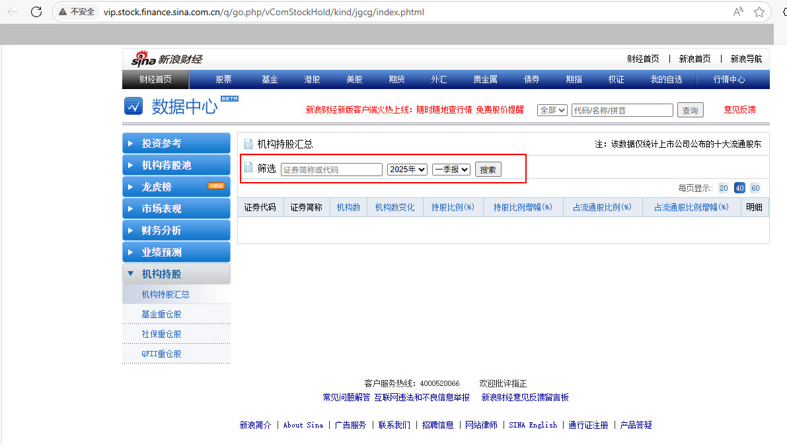
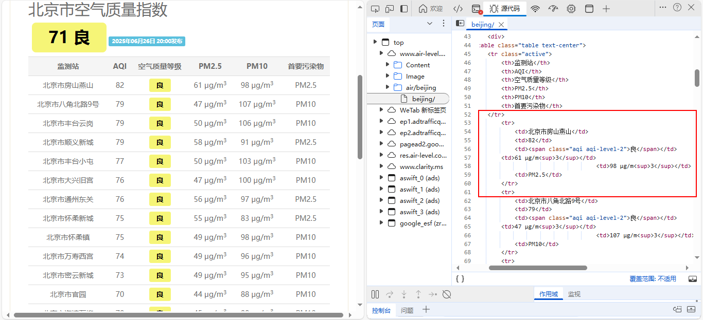

<div style="border-bottom: 4px solid black; width: 100%; box-sizing: border-box; text-align: center; padding-top: 0.1rem;" align="center">
    <h1>网络爬虫技术入门<br/><span>Task 04 网络爬虫任务学习</span></h1>
</div>
<div style="text-align: center;" align="center">
    记录人：zps1011&nbsp;&nbsp;&nbsp;&nbsp;&nbsp;&nbsp;记录时间：2025年6月27日
</div>


## 一、任务1

**爬取`新浪财经机构持股汇总`的数据。**

http://vip.stock.finance.sina.com.cn/q/go.php/vComStockHold/kind/jgcg/index.phtml

当我们打开网站时，发现里面没有内容。这时，我们需要在筛选中选择我们的需求，其中，我选择的是2024年一季报数据。我们可以从源代码中发现，reportdata 为年，quarter 为月，p 为页码。

<div align=center>
	
</div>


```python
import requests
from bs4 import BeautifulSoup
import pandas as pd

# 定义请求头
headers = {
    'User-Agent': 'Mozilla/5.0 (Windows NT 10.0; Win64; x64) AppleWebKit/537.36 (KHTML, like Gecko) Chrome/58.0.3029.110 Safari/537.3'
}

# 定义爬取的页数范围. 假设要爬取前6页的数据。
pages = range(1, 7)  

# 初始化数据列表
data = []

# 遍历每一页
for i in pages:
    url = f"https://vip.stock.finance.sina.com.cn/q/go.php/vComStockHold/kind/jgcg/index.phtml?symbol=%D6%A4%C8%AF%BC%F2%B3%C6%BB%F2%B4%FA%C2%EB&reportdate=2024&quarter=1&p={i}"
    
    response = requests.get(url, headers=headers)
    
    # 设置响应的编码
    response.encoding = 'gbk'
    
    # 解析HTML内容
    soup = BeautifulSoup(response.text, 'html.parser')
    table = soup.find('table', id='dataTable')
    
    if table:
        rows = table.find_all('tr')
        for row in rows[1:]:  # 跳过表头
            cols = row.find_all('td')
            if len(cols) > 2:  # 确保行中有足够的数据
                data.append([col.text.strip() for col in cols])  # 去除多余空白字符
    else:
        print(f"未找到表格数据，可能是页面结构发生变化或请求被限制。")

# 将数据转换为DataFrame
df = pd.DataFrame(data)

# 保存到CSV文件
df.to_csv('机构持股汇总.csv', index=False, encoding='utf-8-sig')

print("数据爬取完成，已保存到机构持股汇总.csv文件中。")
```

## 二、任务2

**爬取给定城市（北京、上海、广州、深圳）的空气质量数据。**

http://www.air-level.com/

从下图我们可知，源代码中已经包含了相应的数据，我们只需提取即可。

<div align=center>
	
</div>


```python
import requests
from bs4 import BeautifulSoup
import pandas as pd

# 定义请求头
headers = {
    'User-Agent': 'Mozilla/5.0 (Windows NT 10.0; Win64; x64) AppleWebKit/537.36 (KHTML, like Gecko) Chrome/58.0.3029.110 Safari/537.3'
}

# 定义要爬取的城市及其对应的URL路径
cities = {
    "北京": "air/beijing/",
    "上海": "air/shanghai/",
    "广州": "air/guangzhou/",
    "深圳": "air/shenzhen/"
}

# 初始化数据列表
data = []

# 遍历每个城市
for city, path in cities.items():
    url = f"http://www.air-level.com/{path}"
    response = requests.get(url, headers=headers)
    
    # 设置响应的编码
    response.encoding = 'utf-8'
    
    # 解析HTML内容
    soup = BeautifulSoup(response.text, 'html.parser')
    
    # 查找空气质量数据表格
    table = soup.find('table')
    if table:
        rows = table.find_all('tr')[1:]  # 跳过表头
        for row in rows:
            cols = row.find_all('td')
            if len(cols) > 1:  # 确保行中有足够的数据
                station = cols[0].text.strip()
                aqi = cols[1].text.strip()
                quality = cols[2].text.strip()
                pm25 = cols[3].text.strip()
                pm10 = cols[4].text.strip()
                primary_pollutant = cols[5].text.strip()
                data.append({
                    "城市": city,
                    "监测站": station,
                    "AQI": aqi,
                    "空气质量等级": quality,
                    "PM2.5": pm25,
                    "PM10": pm10,
                    "首要污染物": primary_pollutant
                })

# 将数据转换为DataFrame
df = pd.DataFrame(data)

# 保存到CSV文件
df.to_csv('城市空气质量.csv', index=False, encoding='utf-8-sig')

print("数据爬取完成，已保存到城市空气质量.csv文件中。")
```


## 总结

本次任务将前 3 个 Tasks 所学的知识通过实践很好的巩固及应用，通过实践检验所学的理论知识。代码运行成功的那一刻满满成就感。于此同时，我也解决了我一直以来的困惑：输出的 csv 文件使用 MS Office 打开除了英文显示正常，中文全是乱码，而使用 WPS 打开 csv 文件中英文均能正常显示的问题 -- 使用 'utf - 8 - sig' 。因为时间关系，只写了任务1、任务2 的笔记，后续将更新其它实践任务的学习笔记。


## 参考资料

- [网页显示和源代码显示不一致](https://www.jianshu.com/p/4b5e31a44b69)
- [利用 utf-8-sig 编码格式解决写入 csv 文件乱码问题](https://blog.csdn.net/qq_36759224/article/details/104417871)


## 附件

- [任务1运行结果](https://github.com/zps1011/zps1011_learning_notes/blob/main/%E7%BB%84%E9%98%9F%E5%AD%A6%E4%B9%A0/%E7%BD%91%E7%BB%9C%E7%88%AC%E8%99%AB/01%E6%9C%BA%E6%9E%84%E6%8C%81%E8%82%A1%E6%B1%87%E6%80%BB.csv)
- [任务2运行结果](https://github.com/zps1011/zps1011_learning_notes/blob/main/%E7%BB%84%E9%98%9F%E5%AD%A6%E4%B9%A0/%E7%BD%91%E7%BB%9C%E7%88%AC%E8%99%AB/02%E5%9F%8E%E5%B8%82%E7%A9%BA%E6%B0%94%E8%B4%A8%E9%87%8F.csv)
- [任务3运行结果](https://github.com/zps1011/zps1011_learning_notes/blob/main/%E7%BB%84%E9%98%9F%E5%AD%A6%E4%B9%A0/%E7%BD%91%E7%BB%9C%E7%88%AC%E8%99%AB/03%E5%9F%8E%E5%B8%82%E5%A4%A9%E6%B0%94%E6%95%B0%E6%8D%AE.csv)
